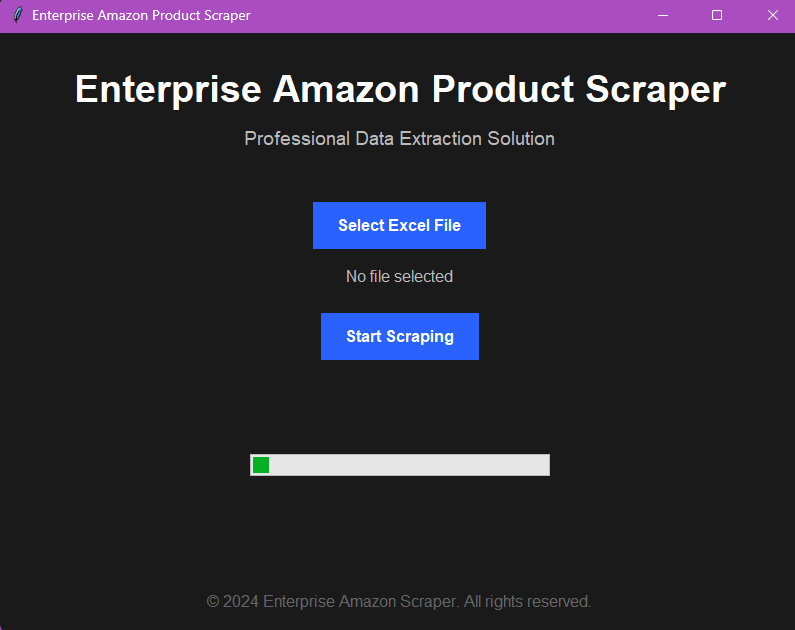

# Amazon-Scraper-blkbrg



A professional Amazon product data scraper with a modern GUI interface. This tool allows you to extract product information from Amazon using ASINs from an Excel file.

## Features
- Modern dark-themed GUI
- Async web scraping
- Excel file input/output
- Progress tracking
- Error handling
- Professional data extraction

## Installation

### Prerequisites
- Python 3.10 or 3.11
- Git

### Mac Installation

1. Clone the repository
```bash
git clone https://github.com/Kakachia777/Amazon-Scraper-blkbrg.git
cd Amazon-Scraper-blkbrg
```

2. Create and activate virtual environment
```bash
# Create virtual environment
python -m venv myenv

# Activate virtual environment
source myenv/bin/activate  # On Mac
```

3. Install required packages
```bash
pip install -r requirements.txt
```

4. Install Playwright browsers
```bash
playwright install
```

### Windows Installation

1. Clone the repository
```bash
git clone https://github.com/Kakachia777/Amazon-Scraper-blkbrg.git
cd Amazon-Scraper-blkbrg
```

2. Create and activate virtual environment
```bash
# Create virtual environment
python -m venv myenv

# Activate virtual environment
myenv\Scripts\activate  # On Windows
```

3. Install required packages
```bash
pip install -r requirements.txt
```

4. Install Playwright browsers
```bash
playwright install
```

## Usage

### Running the Application
```bash
python app.py
```

## Input File Format
The Excel file should contain Amazon ASINs in column E (5th column). ASINs should start with 'B0'.

## Output
- Results are saved in the `output` folder
- Excel file containing:
  - Product titles
  - Prices
  - Descriptions
  - Image URLs

## Project Structure
```
Amazon-Scraper-blkbrg/
├── app.py                  # GUI application
├── amazon_scraper.py       # Scraper logic
├── requirements.txt        # Package dependencies
├── README.md              # Documentation
├── temp/                  # Temporary files
└── output/                # Scraped results
```

## Dependencies
- crawl4ai: Web scraping framework
- playwright: Browser automation
- tkinter: GUI framework
- pandas: Data handling
- openpyxl: Excel file handling
- PIL: Image processing
- nest_asyncio: Async operations

## Important Notes
- Always activate your virtual environment before running or installing
- Make sure you have a stable internet connection
- Some antivirus software might interfere with web scraping
- Respect Amazon's terms of service and rate limits

## Troubleshooting
1. **Playwright Issues**: Run `playwright install` again
2. **Import Errors**: Ensure virtual environment is activated
3. **Excel Errors**: Install openpyxl using pip
4. **GUI Issues**: Ensure tkinter is installed

## Contributing
Pull requests are welcome. For major changes, please open an issue first to discuss what you would like to change.

## License
[MIT](https://choosealicense.com/licenses/mit/)

## Author
[Kakachia777](https://github.com/Kakachia777)

## Acknowledgments
- Built with crawl4ai
- Uses Playwright for web automation
- Modern GUI with tkinter
